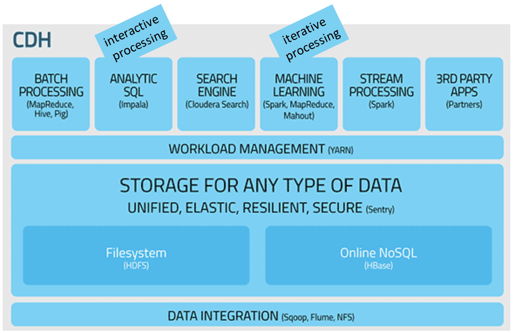

# Big Data essentials for tech coding interview


## Reference
- https://channel9.msdn.com/Events/TechEd/Europe/2012/AZR325


## 4 Vs of Big Data
- Volume
- Variety
- Variability
- Velocity


## Characteristics of Big Data
- New Data Sources
- Non-traditional Data Types
- Large Data Volumes
- New Technologies
- New Economics


## Big Data New Scenarios
- Behavioral Analysis e.g. customer churn
- Sentiment Analysis e.g. social media analysis
- Recommendation Engines e.g. cross-sell, up-sell
- Fraud Detection e.g. clickstream analysis, mining
- Risk Mitigation e.g. asset portfolio analysis
- Root Cause e.g. network log, sensor data analysis
- Marketing Effectiveness e.g. campaign ROI, Ad targeting


## Five Components
- The Data 
- The Hardware
- Tools for solving Time Space Complexity
- Scaling: 0, 1, ∞
- The Data Scientist
    - Curiosity, Creativity, Tenacity
    - Open Mindedness
    - Turn data into Hypothesis to be tested


## Cloud Computing = DFS + MapReduce
- batch processing/data intense tasks
- write once, read many times
- schema-on-read
- scales linearly
### Three pilars
- Storage
- Processing
- Resource management
### Use cases
- analytic queries on large amount of data
    - data intense read-only tasks
    - batch-processing
- NOT for processes that often change the data
- NOT for computationally intense tasks


## Hadoop Architecture

### HDFS (Hadoop Distributed File System) - manage hardware failure
- YARN: job scheduling and cluster resource management; invokes ApplicationMaster for each job
- Master nodes
    - 2 Name nodes: active, standby
        - stores meta-data
    - 2 ResourceManager: active, standby
- Data node
    - storing blocks and computing
    - nodes on a rack (intra-rack network, inter-rack switch)
- HDFS Shell
```shell
$ hadoop fs -put foo.txt foo.txt # copy from local to HDFS
$ hadoop fs -ls / 
$ hadoop fs -cat /user/fred/bar.txt
$ hadoop fs -get /user/fred/bar.txt baz.txt # copy to local
$ hadoop fs -mkdir input
$ hadoop fs -rm -r input_old
```

### MapReduce Layer (Job scheduling / Execution system) - computation splitting and result combination
- Job tracker
- Task tracker

### ETL tools
- Pig (Data flow) (interpreter / Execution engine)
    - turns Pig Latin into MapReduce jobs on Hadoop cluster, but it does not translate your code into MR jobs (execution plans instead)
    - interactive shell (Grunt)
    - helps extract valuable information from web server log files
    - widely used for ETL
    - execution delayed until output is required
    - use case 
        - data sampling for faster iterative development
    - operators and functions
        - ```!= == UPPER() TRIM() RANDOM() ROUND() SUBSTRING(name, 0, 2) AVG() MIN() MAX() COUNT() COUNT_STAR()```
    - data concepts
        - relations: a bag with an assigned name (alias)
        - bags: collections of tuples
        - tuples: collections of values
        - fields: single element
    - PigStorage: default loading function
        - assumes tab-separated column text
        - file patterns ('globs') are supported
        - column default names are ```$0, $1, ...```
        - other loaders: ```TextLoader, BinStorage, HBaseLoader``` (HBase is a scalable NoSQL database on top of Hadoop)
    - data types are ```int, long, float, double, boolean, datetime, chararray, bytearray```
    ```shell
    $ pig
    # Pig Latin statements
    grunt> allsales = LOAD 'sales' AS (name, price);
    grunt> allsales = LOAD 'sales' AS (name:chararray, price:int); # default type is bytearray
    grunt> allsales = LOAD 'sales' USING PigStorage(',') AS (name, price); # change delimiter
    grunt> bigsales = FILTER allsales BY price > 100;
    grunt> hasprices = FILTER Records BY price IS NOT NULL;
    grunt> a_names = FILTER allsales BY name MATCHES 'A.*';
    grunt> spammers = FILTER senders BY email MATCHES '.*@example\\.com$'; # regex support
    grunt> STORE bigsales INTO 'myreport';
    grunt> STORE bigsales INTO 'myreport' USING PigStorage(',');
    grunt> DESCRIBE allsales;
    allsales: {name: chararray, price: int}
    grunt> quit;

    # manipulate HDFS using Pig
    grunt> fs -mkdir sales/;
    grunt> fs -put europe.txt sales/;
    grunt> allsales = LOAD 'sales' AS (name, price);
    grunt> rounded = FOREACH allsales GENERATE ROUND(price) AS rp:float;
    grunt> bigsales = FILTER allsales BY price > 100;
    grunt> STORE bigsales INTO 'myreport';
    grunt> fs -getmerge myreport/ bigsales.txt;

    grunt> sh date;
    Fri May 10 13:05:31 PDT 2013
    grunt> fs -ls; -- lists HDFS files
    grunt> sh ls; -- lists local files

    # local mode
    $ pig -x local salesreport.pig

    grunt> run salesreport.pig;
    $ pig salesreport.pig

    # other useful operations
    grunt> unique = DISTINCT all_alices;
    grunt> sorted = ORDER allsales BY country DESC;
    grunt> some = LIMIT allsales 10;
    grunt> sortedsales = ORDER allsales BY price DESC;
    grunt> top_five = LIMIT sortedsales 5;
    grunt> byname = GROUP sales BY name;
    grunt> DESCRIBE byname;
    byname: {group: chararray, sales: {(name:chararray, price:int)}}
    grunt> DUMP byname;
    (Bob,{(Bob,3999)})
    (Alice,{(Alice,729),(Alice,27999)})
    (Carol,{(Carol,32999),(Carol,4999)})
    grunt> totals = FOREACH byname GENERATE
    group, SUM(sales.price);
    grunt> dump totals;
    (Bob,3999)
    (Alice,28728)
    (Carol,37998)
    grunt> grouped = GROUP sales ALL;
    grunt> DUMP grouped;
    (all,{(Alice,729),(Bob,3999),(Alice,27999),
    (Carol,32999),(Carol,4999)})
    grunt> flat = FOREACH byname GENERATE group,
    FLATTEN(sales.price);
    grunt> DUMP flat;
    (Bob,3999)
    (Alice,729)
    (Alice,27999)
    (Carol,32999)
    (Carol,4999)
    grunt> employees = LOAD 'data' AS (title:chararray, salary:int);
    grunt> title_group = GROUP employees BY title;
    grunt> top_salaries = FOREACH title_group {
            sorted = ORDER employees BY salary DESC;
            highest_paid = LIMIT sorted 3;
            GENERATE group, highest_paid;
    };
    grunt> DUMP top_salaries;
    (Director,{(Director,167000),(Director,165000),(Director,161000)})
    (Engineer,{(Engineer,92300),(Engineer,87300),(Engineer,85000)})
    (Manager,{(Manager,87000),(Manager,81000),(Manager,79000)})
    (President,{(President,192000)})

    # complex types
    grunt> details = LOAD 'salesdetail' AS (
    trans_id:chararray, amount:int,
    items_sold:bag
        {item:tuple (SKU:chararray, price:int)});

    grunt> credit = LOAD 'customer_accounts' AS (
    name:chararray, account:map[], year:int);

    # Bob [salary#52000,age#52]
    grunt> details = LOAD 'data' AS (name:chararray, info:map[]);
    salaries = FOREACH details GENERATE info#'salary';
    ```


### Data collection tool - Flume
- events (fundamental unit of data)
- data flow
    - Source (Syslog, Netcat, Exec, Spooldir, HTTP source): receives event data from its origin
    - Sink (Null, Logger, IRC, HDFS, HBaseSink): sends the event to its destination
    - Channel (Memory, File, JDBC): buffers events between the source and sink
    - Agent
- configured by Java file
- use case: configure a Flume agent to collect data from remote spool directories and save to HDFS
    ```java
    agent1.sources = src1
    agent1.sinks = sink1
    agent1.channels = ch1
    agent1.channels.ch1.type = memory
    agent1.sources.src1.type = spooldir
    agent1.sources.src1.spoolDir = /var/flume/incoming
    agent1.sources.src1.channels = ch1
    agent1.sinks.sink1.type = hdfs
    agent1.sinks.sink1.hdfs.path = /loudacre/logdata
    agent1.sinks.sink1.channel = ch1
    ```
- sink configuration
    ```java
    agent1.sinks.sink1.type = hdfs
    agent1.sinks.sink1.hdfs.path = /loudacre/logdata/%y-%m-%d
    agent1.sinks.sink1.hdfs.codeC = snappy
    agent1.sinks.sink1.channel = ch1

    agent1.sinks.sink1.type = hdfs
    agent1.sinks.sink1.hdfs.path = /loudacre/logdata/%y-%m-%d
    agent1.sinks.sink1.hdfs.fileType = DataStream
    agent1.sinks.sink1.hdfs.fileSuffix = .txt
    agent1.sinks.sink1.channel = ch1
    ```
- start agent
    ```shell
    $ flume-ng agent \
    --conf /etc/flume-ng/conf \
    --conf-file /path/to/flume.conf \
    --name agent1 \
    -Dflume.root.logger=INFO,console
    ```

### BI reporting
- Hive (SQL) (interpreter / Execution engine)
    - get table structure and location of data from metastore and query actual data from HDFS
    - Each Hive table maps to a directory in HDFS
        - Table data stored as one or more files
        - Default format: plain text with delimitedfields
        - Binary formats may offer better performance but limit compatibility
    - Dropping a Hive"managed tables deletes data in HDFS
        - External tables require manual data deletion
    - ALTER TABLE is used to add, modify, and remove columns
    - Views can help to simplify complex and repetitive queries
    - comparison with client-server RDBMS
        - Hive does not update/delete records and not have transactions
        - Hive has high latency
        - Petabytes (Terabytes for RDBMS)
        - Hive only supports
            - ```UNION ALL```
            - subquery in the ```FROM``` clause of the ```SELECT``` statement
        - Hive only supports
            - ```UNION ALL```
            - subquery in the ```FROM``` clause of the ```SELECT``` statement
            - arbitrary levels of subqueries (must be named!)
    - allows to treat a directory of log files like a table
    - support multiple databases
    - data types
        - ```TINYINT, SMALLINT, INT, BIGINT```
        - ```FLOAT, DOUBLE```
        - ```STRING, BOOLEAN, TIMESTAMP, BINARY```
        - ```ARRAY, MAP, STRUCT```
    - join
        - ```JOIN, LEFT OUTER JOIN, RIGHT OUTER JOIN, FULL OUTER JOIN, CROSS JOIN, LEFT SEMI JOIN```
        - ```IN, EXISTS``` is NOT supported
    - functions
        - ```CONCAT(fname, ' ', lname), ROUND(price, 2), CELL(price), FLOOR(price), ABS(temp), SQRT(area), RAND(), UNIX_TIMESTAMP(dt), FROM_UNIXTIME(time), TO_DATE(dt), YEAR(dt), DATEDIFF(dt1, dt2), UPPER(f), SUBSTRING(name, 0, 2), IF(price>1000, 'A', 'B'), CAST(weight as INT), SIZE(array_field)```
    - group by
        - aggregate functions: ```COUNT(), COUNT(fname), COUNT(DISTINCT fname), MAX(salary), MIN(salary), SUM(price), AVG(salary)```
    - file formats
        - text
        - binary (SequenceFile, RCFile)
    - load data from files
    ```shell
    $ hadoop fs -mv sales.txt /user/hive/warehouse/sales/
    hive> LOAD DATA INPATH 'sales.txt' INTO TABLE sales;

    $ hadoop fs -put /home/bob/sales.txt /user/hive/warehouse/sales/
    hive> LOAD DATA LOCAL INPATH 'sales.txt' INTO TABLE sales; # local file to HDFS

    hive> LOAD DATA INPATH '/depts/finance/salesdata' OVERWRITE INTO TABLE sales;

    # load data from a RDBMS (Sqoop)
    $ sqoop import \
    --connect jdbc:mysql://localhost/dualcore \
    --username training
    --password training \
    --fields-terminated-by '\t' \
    --table employees \
    --hive-import
    ```
    - use case
        - sentiment analysis
    - operation examples
    ```shell
    $ hive
    hive> CREATE DATABASE IF NOT EXISTS dualcore;
    hive> DROP DATABASE IF EXISTS dualcore;
    hive> CREATE TABLE stores
            (store_id SMALLINT,
            departments ARRAY<STRING>,
            staff MAP<STRING, STRING>,
            address STRUCT<street:STRING,
                        city:STRING,
                        state:STRING,
                        zipcode:STRING>
            )
            ROW FORMAT DELIMITED
            FIELDS TERMINATED BY '|'
            COLLECTION ITEMS TERMINATED BY ','
            MAP KEYS TERMINATED BY ':';
    1|Audio,Photo|A123:Abe,B456:Bob|123 Oak St.,Ely,MN,55731
    hive> SELECT departments[0] FROM stores;
    Audio
    hive> SELECT staff['B456'] FROM stores;
    Bob
    hive> SELECT address.city FROM stores;
    Ely
    hive> DROP TABLE IF EXISTS stores;
    hive> ALTER TABLE stores RENAME TO clients; # does NOT change data in HDFS
    hive> ALTER TABLE stores CHANGE fname first_name STRING;
    hive> ALTER TABLE stores ADD COLUMNS (city STRING, bonus INT);
    hive> ALTER TABLE stores ADD COLUMNS (city STRING, bonus INT);
    hive> ALTER TABLE stores CHANGE bonus bonus INT AFTER salary;
    hive> ALTER TABLE stores CHANGE bonus bonus INT FIRST;
    hive> ALTER TABLE stores REPLACE COLUMNS (id INT, title STRING, salary INT);
    hive> CREATE TABLE adclicks
        (campaign_id STRING,
        when TIMESTAMP,
        keyword STRING,
        site STRING,
        placement STRING,
        was_clicked BOOLEAN,
        cost SMALLINT)
        LOCATION '/dualcore/ad_data';
    hive> CREATE EXTERNAL TABLE adclicks # only metadata, no change to HDFS
        (campaign_id STRING,
        when TIMESTAMP,
        keyword STRING,
        site STRING,
        placement STRING,
        was_clicked BOOLEAN,
        cost SMALLINT)
        LOCATION '/dualcore/ad_data';
    hive> CREATE VIEW ... AS ...
    hive> DESCRIBE FORMATTED order_info;
    hive> DROP VIEW order_info;
    hive> INSERT OVERWRITE TABLE table1 SELECT ...
    hive> INSERT OVERWRITE DIRECTORY '/dualcore/ny/' SELECT ...
    hive> INSERT INTO TABLE table1 SELECT ...
    hive> INSERT OVERWRITE LOCAL DIRECTORY '/home/bob/ny/' SELECT ...
    hive> SHOW DATABASES;
    hive> USE sales;
    hive> SHOW TABLES IN sales;
    hive> DESCRIBE orders;
    hive> DESCRIBE FORMATTED orders;
    hive> SELECT cust_id, fname, lname
    FROM customers WHERE zipcode=20525;
    100000DESCRIBE FORMATTED orders;
    hive> 1 Brandon Louis
    1000002 Marilyn Ham
    hive> quit;

    $ hive -f myquery.hql
    $ hive -e 'SELECT * FROM users'
    $ hive -S # silent mode
    ```

### RDBMS
- Sqoop (import transaction data from RDBMS)

### Impala
- Impala is a high-performance SQL engine
    - Runs on Hadoop clusters
    - Data stored in HDFS files
    - Inspired by Google’s Dremel project
    - Very low latency – measured in milliseconds
    - Ideal for interactive analysis
- Impala supports a dialect of SQL (Impala SQL)
    - Data in HDFS modeled as database tables
    - uses Hive meta-store

### Tools to choose
- Use Java MapReduce or Spark…
    - You are good at programming
    - You need a flexible framework and a lot of control
- Use Impala or SparkSQL when…
    - You need near real/time responses to ad hoc queries
    - You have structured data with a defined schema
- Use Hive or Pig when…
    - You need support for custom file types, or complex data types
- Use Pig when…
    - You have developers experienced with writing scripts
    - Your data is unstructured/semi-structured
- Use Hive When…
    - You have very complex long/running queries
- Selection criteria include scale, speed, control, and productivity
    - MapReduce and Spark offer control at the cost of productivity
    - Pig and Hive offer productivity but not necessarily speed
    - Relational databases offer speed but not scalability
    - Impala offers scalability and speed but less control


## MapReduce
### Design Concerns
- which data format?
- filter unnecessary data first!
- how many jobs?
- what do the Mappers do, what the Reducers?
- communication cost
- wall-clock time
- amount of memory needed for Mappers/Reducers
- Oozie
    - workflow engine for MR jobs (in XML)
    - works for DAGs
### Workflow
- Input phase: key-value pairs created from all elements in one block is input to one Map task (Mapper)
    - executed by a master controller
    - key is usually the file offset (not used)
    - value is the element
- Map phase: A MapReduce job usually splits the input data-set into independent chunks which are processed by the map tasks in a completely parallel manner
    - run parallel on workers/data nodes
    - output key-value pairs
- Group & Sort phase: The framework sorts the outputs of the maps, which are then input to the reduce tasks; the framework shuffles the output of maps to be reduced
    - executed by a master controller
    - key-value output of Mappers are partitioned/hashed according to the number of Reduce taskers (Reducers)
    - each partition is sorted and grouped by key
    - output key-list-of-value pairs
- Reduce phase: combine list of values associated with each key
    - run parallel on workers/data nodes
    - one Reduce task per partition
    - output (keys and) combined values
- Output phase: write reducers' output to files on HDFS
- The framework takes care of scheduling tasks, monitoring them and re-executes the failed tasks

### Three majot system managed components
- Record reader
- Shuffle and sort
- Output writer

### Mappers
- Upper case
- Explode
- Filter
- Changing keyspaces
- Identity

### Reducers
- Sum
- Average
- Identity

### Job execution
- ResourceManager on master/name node invokes ApplicationMaster on worker/data nodes
- ApplicationMaster invokes NodeManagers for task execution
- Challenges:
    - Shuffle & sort is a bottleneck because no data locality for shuffle & sort and reduce tasks
        - Map tasks store output on local disks
        - intermediate data is transferred across the network
        - Reduce tasks write output to HDFS
    - Slow map tasks are a bottleneck
        - Reduce tasks need to wait for all Map tasks to have finished
        - but data transfer to Reduce tasks starts as soon as each Map task is completed
        - Solution: speculative execution

### Best practices
- Reusing objects
```java
public class WordMapper extends Mapper<LongWritable, Text, Text, IntWritable>
{
    private final static IntWritable one = new IntWritable(1);
    private Text wordObject = new Text();

    @Override
    public void map(LongWritable key, Text value, Context context) throws IOException, InterruptedException {
        String line = value.toString();
        for (String word : line.split("\\W+")) {
            if (word.length() > 0) {
                wordObject.set(word);
                context.write(wordObject, one); // Don't use new objects here
            }
        }
    }
}
```
- Testing locally with small amounts of data
    - set in driver
    - use eclipse
    - use ToolRunner and command line arguments
    ```shell
    $ hadoop jar myjar.jar MyDriver –fs=file:/// -jt=local indir outdir
    ```
    - use MRUnit and Logging
- Testing in pseudo-distributed mode with representative sample data
- Testing on the cluster with small amounts of data 
- Run application on full data on cluster

### WordCount
#### Running commands
```shell
$ javac -classpath `hadoop classpath` myPackage/MyMapper.java myPackage/MyReducer.java myPackage/MyDriver.java
$ jar cvf wc.jar myPackage/*.class
$ hadoop jar wc.jar myPackage.MyDriver input out_dir
$ hadoop fs -ls out_dir
$ hadoop fs -cat out_dir/part-r-00000 | less
$ mapred job -list
$ mapred job -kill jobid
$ yarn application -list
$ yarn application -kill ApplicationId
```
#### Monitoring jobs
- YARN Resource Manager (RM) UI at http://localhost:8080
- HUE Job Browser: web-based interactive query editor in the Hadoop stack that lets you visualize and share data
#### Javascript
```javascript
// Map function
var map = function (key, value, context) {
    var words = value.split(/[^a-zA-Z]/);
    for (var i = 0; i < words.length; i++) {
        if (words[i] !== "")
            context.write(words[i].toLowerCase(), 1); // key, value
    }
};

// Reduce function
var reduce = function (key, values, context) {
    var sum = 0;
    while (values.hasNext()) {
        sum += parseInt(values.next());
    }
    context.write(key, sum);
};
```
#### Java
- InputFormat
    - parses input files into key/value pairs
- WritableComparable, Writable classes
    - wrapper classes for keys and values
- Driver
    - sets InputFormat and input and output types
    - specifies classes for the Mapper and Reducer
- Mapper
    - map() method takes a key-value pair
    - call Context.write() to output intermediate key-value pairs
- Reducer
    - reduce() method takes a key and iterable list of values
    - call Context.write() to output final key/value pairs
- Map-only jobs can be created by setting the number of Reducers to zero
- Configuration
    - command line (via ToolRunner)
    ```shell
    $ hadoop jar myjar.jar MyDriver -D mapreduce.job.reduces=10 –D mapreduce.job.name=“newJob” input output
    $ hadoop jar myjar.jar MyDriver -conf my_conf_file input output
    $ hadoop jar myjar.jar MyDriver –D my_parameter=20 input output
    $ hadoop jar myjar.jar MyDriver -fs=file:/// -jt=local input output
    ```
    - configuration file
    ```java
    Configuration conf = new Configuration();
    conf.addResource("configuration-1.xml");
    conf.addResource("configuration-2.xml");
    ```
    ```shell
    $ hadoop jar myjar.jar MyDriver -conf path-to-config-file/my-defaults.xml input output # ToolRunner
    ```
- Set & retrieve parameters
    - driver
    ```java
    Configuration conf = new Configuration();
    conf.setInt("paramname", value);
    Job job = new Job(conf);
    ```
    - command line
    ```shell
    $ hadoop jar myjar.jar MyDriver -D paramname=23 input output
    ```
    - setup() and cleanup() for Mapper or Reducer
- Distributed cache
    - copy local files to worker nodes
    - Mappers and Reducers can access them directly as read-only files
    ```shell
    $ hadoop jar myjar.jar MyDriver -files path-to-file1,path-to-file2,... input output
    ```
- Partitioner (how keys are distributed to Reducers)
    - HashPartitioner (default)
    - TotalOrderPartitioner
        - extends Partitioner
        - override getPartitioner method
        - specify custom Partitioner in Driver
        ```java
        job.setPartitionerClass(MyPartitioner.class);
        ```
    - Examples
        - use composite keys & custom Partitioners to avoid skew
        - secondary sort
            - Define a composite key type with natural key and secondary key
            - Partition by natural key
            - Define comparator for sorting (by both keys)
            - Define comparator for grouping (by natural key)
        - global sort (TotalOrderPartitioner)
- Combiner (usually identical to reducer)
    - mini reducer on the output of the mapper on the mapper running node
    - commutative and associative
        ```java
        job.setCombinerClass(SumReducer.class);
        ```

```java
// Map
import java.io.IOException;
import org.apache.hadoop.io.IntWritable;
import org.apache.hadoop.io.LongWritable;
import org.apache.hadoop.io.Text;
import org.apache.hadoop.mapreduce.Mapper;
public class WordMapper extends Mapper<LongWritable, Text, Text, IntWritable> {
    @Override
    public void map(LongWritable key, Text value, Context context) throws IOException, InterruptedException {
        String line = value.toString();
        for (String word : line.split("\\W+")) {
            if (word.length() > 0) {
            context.write(new Text(word), new IntWritable(1));
            }
        }
    }
}

// Reduce
import java.io.IOException;
import org.apache.hadoop.io.IntWritable;
import org.apache.hadoop.io.Text;
import org.apache.hadoop.mapreduce.Reducer;
public class SumReducer extends Reducer<Text, IntWritable, Text, IntWritable>
{
    @Override
    public void reduce(Text key, Iterable<IntWritable> values, Context context) throws IOException, InterruptedException {
        int wordCount = 0;
        for (IntWritable value : values) {
            wordCount += value.get();
        }
        context.write(key, new IntWritable(wordCount));
    }
}
```
#### Post-WordCount processing
- Analyze the semantic word-document matrix (word vector, document vector)
- Singular value decomposition (SVD) of words by contexts matrix
- Different similarity measures emphasize different aspects
    - Dot product
    - Cosine
    - Euclidean

### Text Mining/Information Retrieval
- Term Frequency - Inverse Document Frequency (TF-IDF)
    - MapReduce solution
        - WordCount per document (tf)
        - count word-document pairs for each word (n), where n is number of documents that contains the item
        - compute TF-IDF (tf x idf = tf x log(N/n)), where N is total number of documents
    - preprocessing in reality
        - stemming: remove plurals, tense, possessives, ...
        - filter stop words: a, the, and, in, to, ...
    - Possible problems
        - pairs may not fit in memory
    - Possible solutions
        - ignore stop words
        - Combiner
        - write out intermediate date to a file and use another MapReduce pass
- Word co-occurrence - frequency with which two words appear close to each other in a document
    - communication cost
        - number of key-value pairs that are input to the tasks of a MapReduce computation/workflow
            - key-value pairs that are loaded from HDFS (Mapper input)
            - key-value pairs that are transferred (Reducer input)
            - we may omit the input to the first job when comparing different algorithms for the same application (as it is the same for all algorithms)
        - total communication cost = sum of communication costs of all involved tasks
    - pairs
        - (wordA, wordB), count
        - easy, heavy communication, time-consuming group&sort
    - stripes
        - wordA, {(wordB, count), (wordC, count), ...}
        - efficient group&sort, difficult, buffer all neighboring words of a given word

### Recommendation Systems
- Top-N list
    - job 1: aggregate item counts
    - job 2: produce top-N-list based on counts
    - single reducer produce global top-N-list
    - Pros
        - general trend
        - simple to compute
        - same computation for all users
        - enough data
    - Cons
        - same recommendations for all users (not personalized)
        - does not consider user preferences
- Co-occurrence based recommendation
    - job 1: group items bought by the same user
    - job 2: solve the co-occurrence problem on items
        - pairs
            - communication cost: (k^2-k)/2
            - memory: (2 item-ids, 1 count) x m
        - stripes
            - communication cost: (k-1)
            - memory: (1 item-ids, k-1 item-ids and counts) x m
        - memory - time tradeoff
    - (job 3: Top-N-List on pairs of items)
    - Pros
        - recommendations reflect preferences of other users
        - the item a user is interested in has some similarity with the commended items
        - same computation for all users (enough data)
        - same algorithm for Frequently bought together…
    - Cons
        - still only popular items will be recommended
        - same recommendations for the same item for all users
        - not user personalized
            - personal user preferences are not considered
            - preferences of other users are considered implicitly
- Collaborative filtering
    - utility matrix (users vs items) to predict missing ratings & recommend items with high (predicted) ratings
    - similarity of item rating vectors between two users
        - Jaccard similarity with rounding
        - Cosine similarity
            - normalizing (subtracting user's mean rating)
                - remove bias
                - improves cosine measure (= Pearson)
        - Pearson correlation
        - Why not Euclidean?
            - need to define similarity (inverse distance?)
            - sensitive to outliers
    - Step 1: find other users (N) whose ratings are similar to x's ratings
        - job 1: preprocessing MapReduce job
            - number of rated items per user x
            - sum of all ratings of user x
        - job 2: for every item find pairs of users that have both rated it (overlap) and pre-compute statistics
            - user co-occurrence
        - job 3: for every pair of users aggregate statistics across all items
            - user similarity
    - Step 2: estimate x's ratings based on ratings of users in N
        - top-k similarity grouping on user x
        - get users that have rated item i
        - predict user's rating for item i
            - average
            - weighted
    - Challenges
        - utility matrix is sparse
            - solution: cluster items
    - Duality
        - item-item similarity
        - more efficient
        - easier to find similar items
        - less efficient for larger number of items
    - Benefits
        - incorporate user preferences
        - only data we need is ratings
    - Problems
        - tends to recommend more popular items
        - not satisfactory for the users with unique tastes/preferences
        - recommendations cannot be justified/explained
    - Efficiency: Finding N most similar users is costly
        - assume utility matrix is changing infrequently
            - pre-compute recommendations (offline process)
    - Other techniques to compute similarity
        - nearest-neighbor search in high dimensions
        - clustering
    - in between Machine Learning and Data Mining
        - predict ratings
        - no features
        - use similarities
- Content-based recommendation
    - based recommendations on item properties similar to user profile
    - helps with new item problem
- Demographics
    - deal with new user problem


## Machine Learning
### Common algorithms
- K-means Clustering
- Naïve Bayes
- Decision Tree
- Neural network
- Hierarchical Clustering
- Positive Matrix Factorization
- Hidden Markov Models
- Restricted Boltzmann Machine
- Random forest
- Boosting
- Support Vector Machines
- SVD, PCA, ICA
- Genetic Algorithms


## Typical Workflow for a Cloud Job
- Use Curl or Python to collect the tweets (JSON format)
- FTPS the data to your Hadoop cluster
- Create a raw HIVE table containing just the Json items
- ETL the data using either Serde plugins or by hand
- Run HIVE queries!

## Data Processing Tools
### Batch processing (MapReduce)
- fixed-size data
- one query - one answer

### Stream processing (Storm, Spark, Streaming, Samza)
- unbounded stream of data

### Interactive processing/SQL (Impala Hive)
- human in the loop (fast query engine needed)

### Iterative processing (Spark)
- machine learning

### Seach (Solr)
- indexing documents
- building a search index

### Apache Spark
#### Pros
- MapReduce = Map -> Group & Sort -> Reduce
    - not very flexible
    - slow
    - not interactive
    - Java only
    - little support for processing streaming and graph data
    - no machine learning library (you may use Mahout)
- Apache Spark
    - flexible arbitrary DAGs of Map, Group & Sort, and Reduce Phases
    - can keep data in memory
    - faster than Hadoop MapReduce workflows
    - higher-level abstraction than MapReduce
    - Java, Python or Scala
    - interactive shell
    - shares the same benefits for Big Data processes
        - Fault-tolerance
        - Distributed storage and analysis
        - Parallelism
        - Scalability
    - other benefits
        - web UI
        - pair RDDs (key-value pairs)
        - configuration options
        - logging (Log4j)
        - partitioning
#### Components
- Spark SQL
- Spark Streaming
- MLlib
- GraphX
#### Characteristics
- written in Scala
- functional
- runs in JVM
- interactive shell
- preconfigured Spark Context - sc
#### Resilient distributed datasets (RDDs)
- data automatically partitioned across worker nodes
- RDDs are immutable
- flexible types
- additional functionality
    - pair RDD -> key-value pairs
    - double RDDs -> numeric data
- creation from
    - files
    - data in memory
    - another RDD
- lineage: each action re-execute the lineage transformations starting with the base
    - all RDDs' lineages are tracked by Spark
    - Resiliency is a product of tracking lineage 
    - RDDs can always be recomputed from their base if needed 
    - problems for long lineage
        - stack overflow
        - recovery is expensive
        - solution: checkpointing saves the data to HDFS
- persistence: persisting an RDD saves the data (by default in memory); subsequent operations use saved data
    - If not enough memory is available, persisted partitions will be cleared from memory 
        - Least recently used partitions cleared first 
    - TransformaIons will be re-executed using the lineage when needed
    - partitions are distributed across a cluster
    - persistence level
        - default is memory
        - storage location (```MEMORY_ONLY, MEMORY_AND_DISK, DISK_ONLY```), format in memory (```MEMORY_ONLY_SER, MEMORY_AND_DISK_SER```), partition replication (```MEMORY_ONLY_2, MEMORY_AND_DISK_2, DISK_ONLY_2, MEMORY_AND_DISK_SER_2, DISK_ONLY_2```)
        ```py
        from pyspark import StorageLevel
        myrdd.persist(StorageLevel.DISK_ONLY)
        ```
        - stop or change an RDD to a different persistence level
        ```py
        rdd.unpersist()
        ```
    - When and how ?
        - When? - dataset likely to be re-used like iterative algorithm, machine learning
        - How?
            - memory (speed)
            - serialization (space saving)
            - disk (recomputation is more expensive than disk read such as expensive function or filtering large datasets)
            - replication (recomputation is more expensive than memory)

- Fault-tolerance
    - if a pratition persisted in memory becomes unavailable,
        - The driver starts a new task to recompute the partition on a different node (because persistence is distributed) 
        - Lineage is preserved, data is never lost
#### Usage
- load file (use Hadoop InputFormat and OutputFormat Java classes)
```py
var mydata = sc.textFile("purplecow.txt")
var mydata = sc.textFile("mydata/*.txt")
var mydata = sc.textFile("mydata1.txt,mydata2.txt")
mydata.count()
sc.wholeTextFiles()
```
- operations
    - action
    ```py
    count()
    distinct()
    take(n)
    collect()
    saveAsTextFile(file)
    ```
    - transformation
    ```py
    map(lambda line: line.upper())
    flatMap(lambda line: line.split()).distinct()
    filter(lambda line: line.startswith('I'))
    rdd1.subtract(rdd2)
    rdd1.zip(rdd2)
    rdd1.union(rdd2)
    ```
    - others
    ```py
    sortBy()
    first()
    foreach()
    top(n)
    sample()
    takeSample()
    ```
    - double RDD
    ```py
    mean()
    sum()
    variance()
    stdev()
    ```
- functions
    - Named
    ```py
    def toUpper(s):
        return s.upper()
    mydata = sc.textFile("mydata.txt")
    mydata.map(toUpper).take(2)
    ```
    - Anonymous
    ```py
    mydata.map(lambda line: line.upper()).take(2)
    ```
- pair RDDs
    - create
    ```py
    users = sc.textFile(file).map(lamda line: line.split('\t')).map(lambda fields: (fields[0], fields[1]))

    sc.textFile(logfile).keyBy(lamda line: line.split(' ')[2])
    ```
    - actions
    ```py
    countByKey()
    ```
    - transformations
    ```py
    groupByKey()
    sortByKey()
    join() # return an RDD containing all pairs with matching keys from two RDDs
    ```
- workflow
    - use Pair RDDs
    - Map Phase
        - operates on one record at a time
        - maps each record to one or more new records
            - e.g. map, flatMap, filter, keyBy
    - Reduce Phase
        - Works on map output
        - Consolidates multiple records
            - e.g. reduceByKey, sortByKey, countByKey, groupByKey, join, mean
- Example
    - Word count
    ```py
    counts = sc.textFile(file)
            .flatMap(lambda line: line.split())
            .map(lambda word: (word, 1))
            .reduceByKey(lambda v1, v2: v1 + v2)
    ```
    - Average word length
    ```py
    avglens = sc.textFile(file)
            .flatMap(lambda line: line.split())
            .map(lambda word: (word[0], len(word)))
            .groupByKey()
            .map(lambda (k, values): (k, sum(values)/len(values)))
    ```
- lazy execution
    - data in RDDs is not processed until an action is performed such as ```mydata_filt.count()```
- pipelining
    - When possible, Spark will perform sequences of transformations by **row** so no data is stored
- Programming Spark
    - Spark program
    ```py
    import sys
    from pyspark import SparkContext

    sc = SparkContext()
    counts = sc.textFile(file)
            .flatMap(lambda line: line.split())
            .map(lambda word: (word, 1))
            .reduceByKey(lambda v1, v2: v1 + v2)
    for pair in counts.take(5):
        print(pair)
    sc.stop()
    ```
    - run Spark
        - locally without distributed processing (single core)
        - locally with multiple worker threads (multi core)
        - on a cluster in client mode or cluster mode
    ```shell
    $ spark-submit WordCount.py fileURL # local run
    $ spark-submit --master yarn-client WordCount.py fileURL # client mode
    $ spark-submit --master yarn-cluster WordCount.py fileURL # cluster mode
    $ spark-submit --master local[3] WordCount.py fileURL # 3 threads
    $ spark-submit --master local[*] WordCount.py fileURL # as many as threads - default
    ```
- Data partitioning
    - partition based on size
    ```py
    sc.textFile('myfile', 3) # minimum number of partitions
    ```
    - each file is one partition
    ```py
    sc.textFile('mydir/*')
    ```
    - key-value pair (key: filename, value: file content)
    ```py
    sc.wholeTextFile('mydir')
    ```
    - configure 
    ```py
    spark.default.parallelism 10
    # or
    words.reduceByKey(lambda v1, v2: v1 + v2, 15)
    ```
- Stages, Tasks, Job, Application
    - stages: operations that run on the same data partitioning in parallel across executors/nodes
    - tasks: within a stage, operations executed by one executor/node that are pipelined together
        - number of tasks = number of partitions
    - Job: a set of tasks executed as a result of an action
    - Application: can contain any number of jobs managed by a single driver
- Save to HDFS
    - default: data not stored in HDFS
    - perform a save action
- What is Spark good for?
    - Large amount of data -> Distribued storage
    - Intensive computations -> Distributed computing
    - Iterative algorithms -> In-memory processing and pipelining